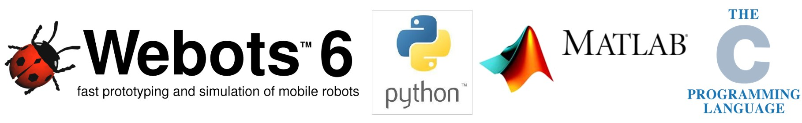
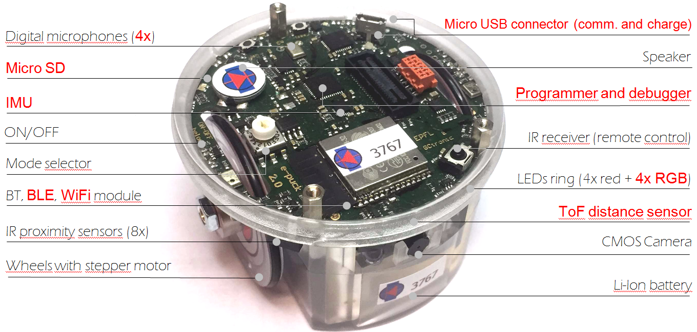

<!--Based on an earlier version of https://github.com/jaehughes/SimPlus-->
# RoboCup Simulation (Secondary/Open)

This page gives some install, set up and introduction to use Webots for a Rescue based simulation setup. This is a demo, or trial, for creating a Rescue Simulation based platform to bridge the gap between RoboCupJunior Rescue Simulation & RoboCup Major Rescue Simulation. This platform uses open-source software, and the installation has been kept as simple as possible to provide a low barried to entry.  A number of introductory exercises are provided, in addition to which many more are available online.  Specific 'competition worlds' are also provided which are similar to thoose which will be used in the competition.  

# About

This rescue scenario based simulation competition will use [Webots](https://cyberbotics.com/). Webots is an open-source robot simulator. It is widely used in industry, education and research. The Webots project started in 1996, initially developed at the Swiss Federal Institute of Technology (EPFL) in Lausanne, Switzerland.  The simulator uses the physics engine ODE (Open Dynamics Engine) for detecting of collisions and simulating rigid body dynamics. The ODE library allows one to accurately simulate physical properties of objects such as velocity, inertia and friction.  It is used widely in both research and teaching, examples of useage can be found [here](https://www.youtube.com/user/cyberboticswebots).

<iframe width="300" align="centre" src="https://www.youtube.com/embed/O7U3sX_ubGc" frameborder="0" allow="accelerometer; autoplay; encrypted-media; gyroscope; picture-in-picture" allowfullscreen></iframe>

Controllers for robots can be developed in a variety of different lanugages including C, Python and MatLab.  Although Python will be used in these tuotorials, teams are welcome to use any of the alternative languages which are provided.  

<figure>

</figure>


# Rules

This competitions focuses on an abstraction of a rescue scenario.  A world will be provided which includes 'victims' which are represented by balls.  These balls victims must be located, it must be determined if these balls are 'dead' or 'alive' and if possible the alive balls should be delivered to the home area.  
* Alive victims will be represented by balls which are red and have a happy face
* Dead victims will be represented by balls which are blue and have a sad face.

To 'locate' the ball, the robot must travel within 0.1m of the ball and stay stationary for at least 2 seconds.  

# Installation

The Webots software (which is free!) can be downloaded from [here](https://cyberbotics.com/download).  Installations are provided for Windows, Mac and Linux.  Further information on the installation process can be found [here](https://cyberbotics.com/doc/guide/installing-webots).  

Python should also be installed as Python is used to create the worlds.  Webots requires Pytohn 2.6 or 3.6, we will assume version 3.6 is used.  Instructions on installing Python can be found [here](M
https://cyberbotics.com/doc/guide/using-python).  For Windows PCs it is key that the PATH should include the location of the python installation.

Additionally if you would like to use Matlab/C/C++ more information can be found here:
* [Using Matlab.](https://cyberbotics.com/doc/guide/using-matlab) Version 2015b only, and a licence will be needed.
* [UsingC/C++.](https://cyberbotics.com/doc/guide/using-c) Webots includes C/C++ compiler


# Resources

There are a number of online resources online, including many activities.  The most useful, are summarised here:
* [Webots Reference Guide](https://cyberbotics.com/doc/reference/index)
* [Webots Getting Started](https://cyberbotics.com/#support)
* [Webots E-Book](https://en.wikibooks.org/wiki/Cyberbotics%27_Robot_Curriculum) - provides an curriculum for Webots using the Epuc robot.  Starts quite simply, but gets rapidly more challenging!

# The Robot
The robot used in this simulation is based on a real-world robot which has been created for education and research, the Epuck2.  Specific details about the robot can be found [here](https://cyberbotics.com/doc/guide/epuck2).    

The robot is equipped with a differential drive wheel system actuated by two stepper motors, a number of distance sensors, light sensors and a camera.  This is summarised in the Figure below.  

<figure>
  
</figure>


# Getting Started

The Webots simulator allows worlds and robots to be created using Proto scripting, and also allows controllers for robots and other objects to be developed.  

Webots simulations comprise of three key parts:
1. A Webots world file (.wbt) that defines one or several robots and their environment. The .wbt file does sometimes depend on external PROTO files (.proto) and textures.
2. One or several controller programs for the above robots (in C/C++/Java/Python/MATLAB).
3. An optional physics plugin that can be used to modify Webots regular physics behavior (in C/C++).

In this tutorial we will focus on developing the controllers for the robots, in particular focusing on developing in Python.

## Introduction to Building Worlds 

To understand how to create, edit and build rooms, it is recommmended that you follow the tutorial [here](https://cyberbotics.com/doc/guide/tutorial-1-your-first-simulation-in-webots-20-minutes).  This will provide basics in building worlds, however, the following activities focus on developing controllers for robots with practise worlds provided.    


# Initial Activities

## Basic Navigation (Avoid obstacles)

### Step 1: Open/create a sample world

To start we will create a simple world which contains walls and obstacts and also an Epuc robot.  To create this world, follow the tutorial here, or download the world from here.

### Step 2: Create New Controller & move forwards

Next, we will create a new 'controller' for the epuc robot.  This is going to be written in Python, and can be created using the controller wizard.  To create this controller start from the toolbar:

> Wizards > New Robot Controller > Next > Pyton >> 'provide name, e.g.:avoidObstactles > Finish

A new textfile 'avoidObstacles.py should now open in the text editor component on the Webots Software interface.  We are going to start with a basic program to make the robot go forwards.

```python
from controller import Robot

robot = Robot()  # create the Robot instance.  
maxSpeed = 6.2   # rated maximum speed of Epuc motors

# get the time step of the current world.
timestep = int(robot.getBasicTimeStep())

# get the motor devices for the differential drive of the Epuc
motorl = robot.getMotor("left wheel motor")
motorr = robot.getMotor("right wheel motor")

# Configure the movement limits of the stepper motors in the wheels
motorl.setPosition(float("inf"))
motorr.setPosition(float("inf"))

while robot.step(timestep) != -1:
    motorl.setVelocity(maxSpeed)
    motorr.setVelocity(maxSpeed)
    pass
```

This program should now be saved after which it can be loaded onto the robot.  To do this on the left hand side of the webots interface, find the node that corresponds to the robot, this will be called something like 'Robot E-puck'.  Expand this node, and scroll down to the find the node 'controller', click on the select button below the tree, and from the pop-up choose the name of the controller you have developed.  

You can then run this simulation - press the play button above the simulation.  The robot should now move forwards.

### Step 3: Use the distance sensor & avoid obstacles

## Using the camera and detecting balls


 
